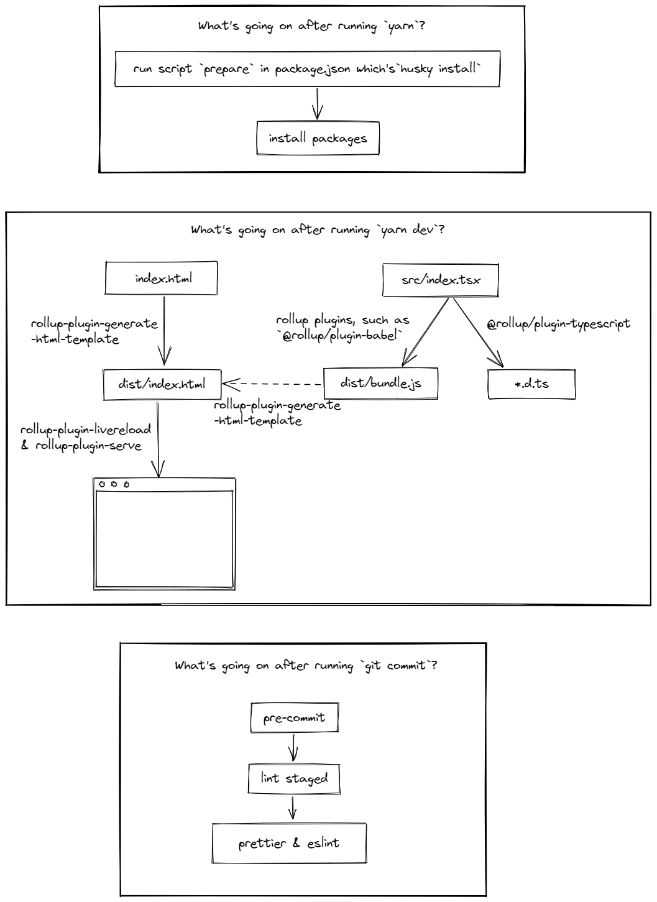

# React Global Mentoring Program

## Completion

|                                     |                             |         |     |
| ----------------------------------- | --------------------------- | ------- | --- |
| Module #1: Help module              | Oct 11, 2022                | 1 day   | ✅  |
| Module #2: Core concepts            | Oct 12, 2022 - Oct 18, 2022 | 7 days  | ✅  |
| Module #3: ~~Webpack~~ Rollup       | Oct 19, 2022 - Oct 25, 2022 | 7 days  | ✅  |
| Module #4: Components (Part 1)      | Oct 26, 2022 - Nov 01, 2022 | 7 days  |     |
| Module #5: Components (Part 2)      | Nov 02, 2022 - Nov 08, 2022 | 7 days  |     |
| Module #6: Hooks                    | Nov 09, 2022 - Nov 15, 2022 | 7 days  |     |
| Module #7: Redux                    | Nov 16, 2022 - Nov 29, 2022 | 14 days |     |
| Module #8: Forms                    | Nov 30, 2022 - Dec 06, 2022 | 7 days  |     |
| Module #9: Routing                  | Dec 07, 2022 - Dec 13, 2022 | 7 days  |     |
| Module #10: Testing                 | Dec 14, 2022 - Dec 20, 2022 | 7 days  |     |
| Module #11: SSR                     | Dec 21, 2022 - Dec 27, 2022 | 7 days  |     |
| Module #12: Patterns, tips & tricks | Dec 28, 2022 - Jan 03, 2023 | 7 days  |     |
| Module #13: Clean Code              | Jan 04, 2023 - Jan 06, 2023 | 3 days  |     |
| Module #14: CloudX: Foundations     | Jan 07, 2023 - Jan 09, 2023 | 3 days  |     |

## Module #2: Core concepts

https://stackblitz.com/edit/react-84z59b?file=src/App.js

## Module #3: ~~Webpack~~ Rollup

### Getting started

```sh
# install
yarn

# develop
yarn dev

# build
yarn build
```

#### What's going on after running commands above?



You can click [here](https://excalidraw.com/#json=DeOoPxllmrObvAj66gmMV,26oCT1_DPb-38MqzSPJ3Kg) to edit the graph.

## Q&A

- What can we do to avoid `--bundleConfigAsCjs` in the rollup command? (in `package.json`)

- How does HMR work? What's the difference between HMR and [rollup-plugin-livereload](https://github.com/thgh/rollup-plugin-livereload)?

- What is `babelHelpers`? (in `rollup.config.js`)

- How does [@rollup/plugin-node-resolve](https://github.com/rollup/plugins/tree/master/packages/node-resolve) work?

- In what situation we need to treat a package as an `external` package, and how to?

- What does [@rollup/plugin-replace](https://github.com/rollup/plugins/tree/master/packages/replace) do? and why we need to use `JSON.Stringify`?

  We can see React use `process.env.NODE_ENV` in its code, but browser doesn't have `process`

  > [Note](https://github.com/rollup/plugins/tree/master/packages/replace#usage): Values must be either primitives (e.g. string, number) or function that returns a string. For complex values, use JSON.stringify. To replace a target with a value that will be evaluated as a string, set the value to a quoted string (e.g. "test") or use JSON.stringify to preprocess the target string safely.

- What is the right way to convert files from TypeScript to JavaScript?

  https://www.typescriptlang.org/docs/handbook/babel-with-typescript.html

  In a Rollup bundled project, `@babel/preset-typescript` is to generate your JS files, `@rollup/plugin-typescript` is to do type checking and .d.ts file generation.

- How does dev server, such as [rollup-plugin-serve](https://github.com/thgh/rollup-plugin-serve), work?

- (!) Plugin typescript: @rollup/plugin-typescript TS2307: Cannot find module './netflixroulette.svg' or its corresponding type declarations.

  Although fixed with: https://www.codegrepper.com/code-examples/typescript/TS2307%3A+Cannot+find+module+%27svg%27+or+its+corresponding+type+declarations. But I still don't understand why ts handle the .svg file ,and why I need to make up with a .d.ts file but svgr didn't do that.

## Fixed issues

- Cannot `import ReactDOM from 'react-dom/client'`

  https://rollupjs.org/guide/en/#error-name-is-not-exported-by-module

- Cannot use JSX unless the '--jsx' flag is provided. (ts)

  Add `"jsx": "react"` to `tsconfig.json`

- When `import React from 'react'`, ts trows that **Module declared with 'export =', and can only be used with a default import when using the 'esModuleInterop' flag.**

  Add `"esModuleInterop": true` to `tsconfig.json`

- Missing shims for Node.js built-ins when creating a browser bundle that depends on "stream".

  Need to include https://github.com/FredKSchott/rollup-plugin-polyfill-node

## Issues

- (!) Circular dependencies

  > node_modules/rollup-plugin-node-polyfills/polyfills/readable-stream/duplex.js -> node_modules/rollup-plugin-node-polyfills/polyfills/readable-stream/readable.js -> node_modules/rollup-plugin-node-polyfills/polyfills/readable-stream/duplex.js
  > node_modules/rollup-plugin-node-polyfills/polyfills/readable-stream/duplex.js -> node_modules/rollup-plugin-node-polyfills/polyfills/readable-stream/writable.js -> node_modules/rollup-plugin-node-polyfills/polyfills/readable-stream/duplex.js

  https://github.com/calvinmetcalf/rollup-plugin-node-builtins/issues/39
